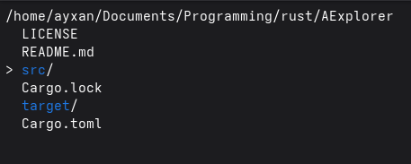

```text
 ______  ____                   ___                                
/\  _  \/\  _`\                /\_ \                               
\ \ \L\ \ \ \L\_\  __  _  _____\//\ \     ___   _ __    __   _ __  
 \ \  __ \ \  _\L /\ \/'\/\ '__`\\ \ \   / __`\/\`'__\/'__`\/\`'__\
  \ \ \/\ \ \ \L\ \/>  </\ \ \L\ \\_\ \_/\ \L\ \ \ \//\  __/\ \ \/ 
   \ \_\ \_\ \____//\_/\_\\ \ ,__//\____\ \____/\ \_\\ \____\\ \_\ 
    \/_/\/_/\/___/ \//\/_/ \ \ \/ \/____/\/___/  \/_/ \/____/ \/_/ 
                            \ \_\                                  
                             \/_/
```



# 🗂️ AExplorer
AExplorer lightweight terminal-based file manager written in rust. It provides a Vim-like interface for navigating and managing files directly from the terminal.

---

## ✨ Features

- Browse directories in a terminal UI
- Vim-style navigation (`h`, `j`, `k`, `l`)
- Create files and directories
- Copy, move, rename, and delete files/folders
- Toggle hidden files visibility
- Open files in your default `$EDITOR`
- Launch a terminal in the current directory
- Recursive directory copy support
- Simple confirmation prompts for destructive actions

---

## ⌨️ Keybindings

| Key | Action |
|-----|--------|
| `j` | Move down |
| `k` | Move up |
| `h` | Go to parent directory |
| `l` | Enter directory |
| `a` | Create directory |
| `f` | Create file |
| `d` | Delete file/directory |
| `c` | Copy file/directory |
| `m` | Move file/directory |
| `r` | Rename file/directory |
| `.` | Toggle hidden files |
| `o` | Open file in `$EDITOR` |
| `t` | Open terminal here |
| `?` | Show help |
| `q` | Quit |

---

## ⚙️ Requirements

- An OS
- A terminal emulator (required for the terminal-launch feature)
- A filesystem (optional)

---

## 📦 Dependencies

This project uses:

- `crossterm` → terminal control (cursor movement, input handling, raw mode)
- `colored` → colored directory display

---

## 🚀 Build & Run

Clone the repository and run:

```bash
git clone https://github.com/ayxan20145-prog/AExplorer.git
cd AExplorer
cargo run
